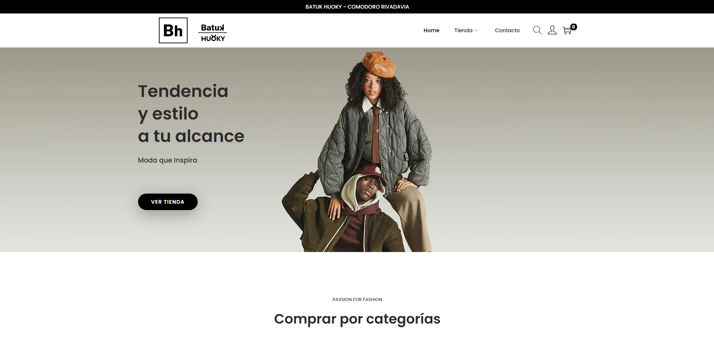
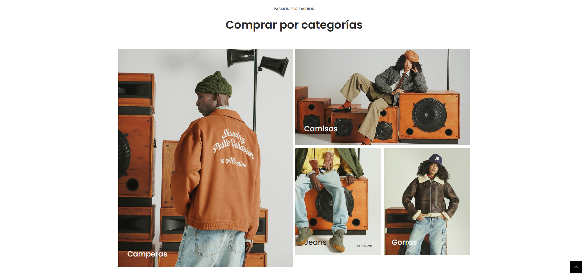
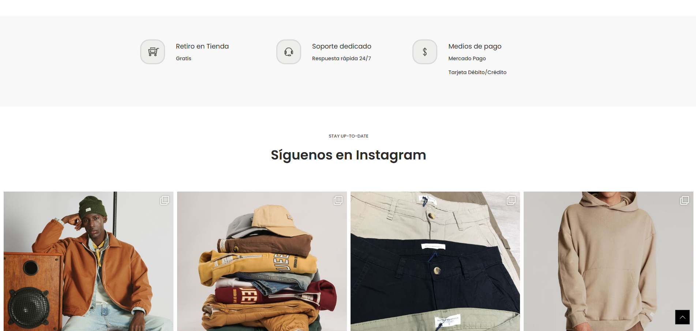
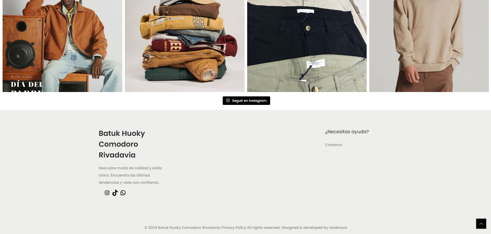
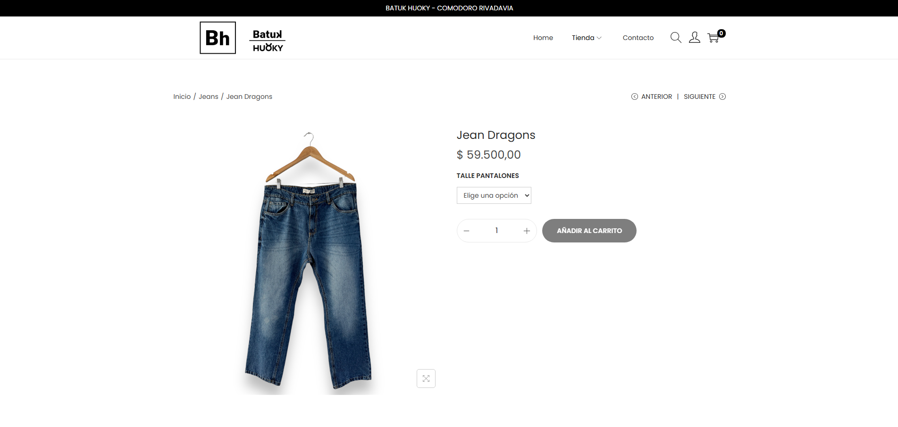
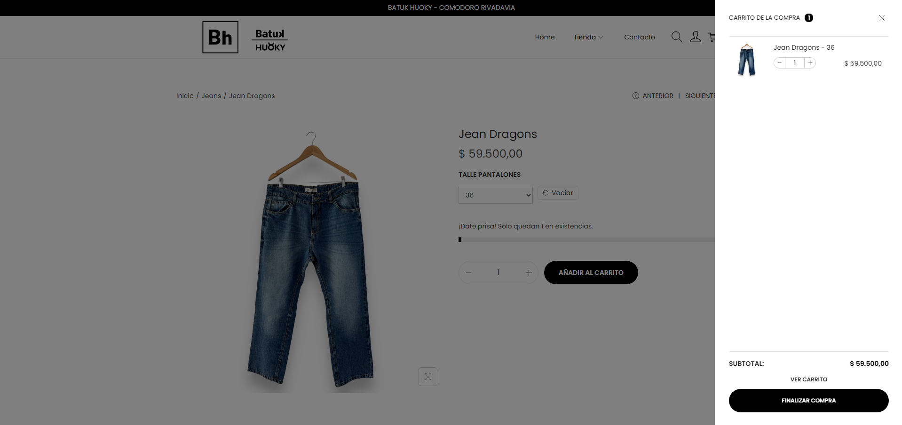
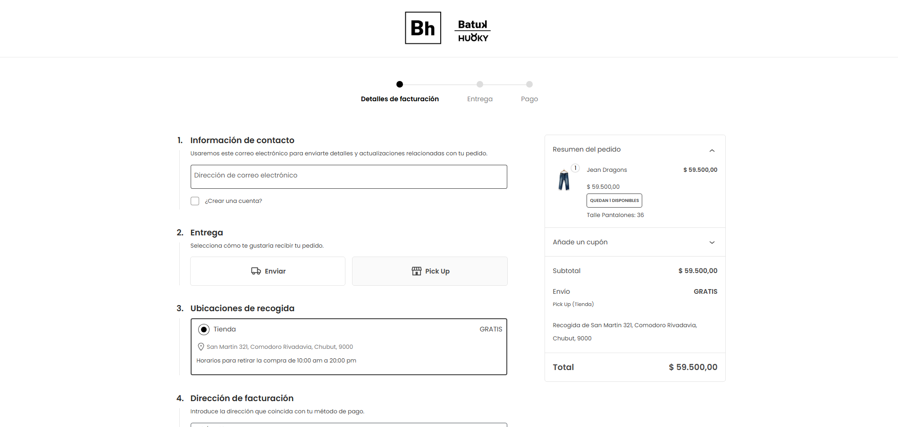

# 🧵 Batuk Huoky – Tienda de Indumentaria Masculina

¡Bienvenidos a Batuk Huoky!  
Este proyecto es una **página web de e-commerce** desarrollada en **WordPress + WooCommerce**, con un enfoque moderno, simple y funcional para una tienda de ropa masculina.

---

## 🖼️ Capturas del sitio

 
 

---

## ⚙️ Tecnologías utilizadas

- 🧩 WordPress (CMS)
- 🛒 WooCommerce
- 🎨 CSS personalizado
- 🔌 Plugins para envíos, pago y seguridad
- 📱 Diseño responsive

---

## 💡 Funcionalidades

- Catálogo con productos filtrables
- Carrito de compras
- Formulario de contacto
- Panel de administración para gestionar pedidos
- Diseño adaptado a dispositivos móviles

---

## 📌 Estado del proyecto

✅ Sitio funcional  
🔐 Código no descargable por limitaciones del hosting  
💾 Backup visual disponible en este repositorio

---

## 📄 Notas finales

Este sitio fue diseñado como parte de mi portfolio profesional para mostrar habilidades en:

- Maquetación visual y estructura
- Configuración avanzada de WordPress
- Experiencia de usuario
- E-commerce con WooCommerce

---
